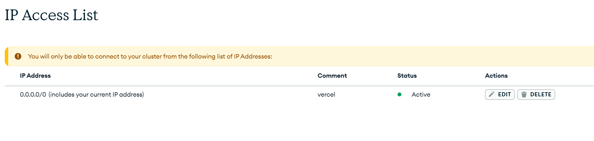
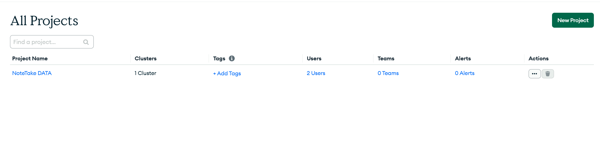
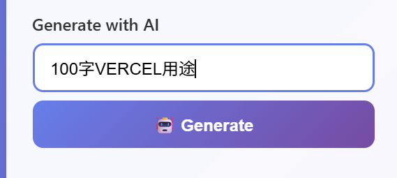
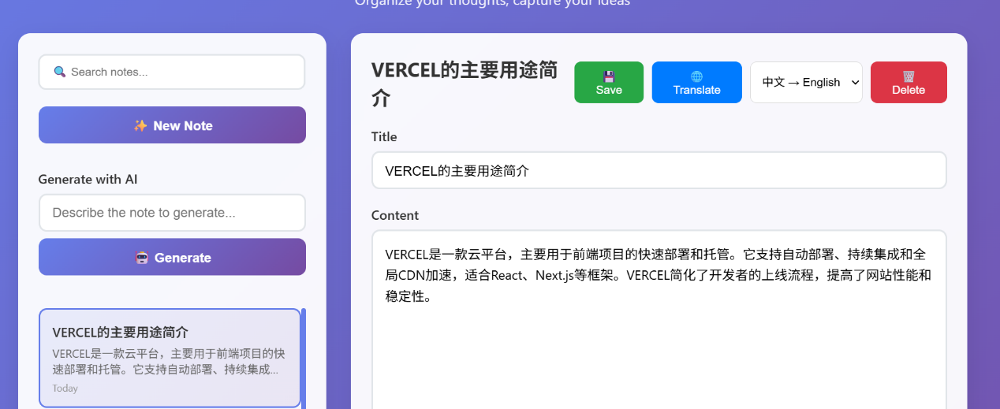
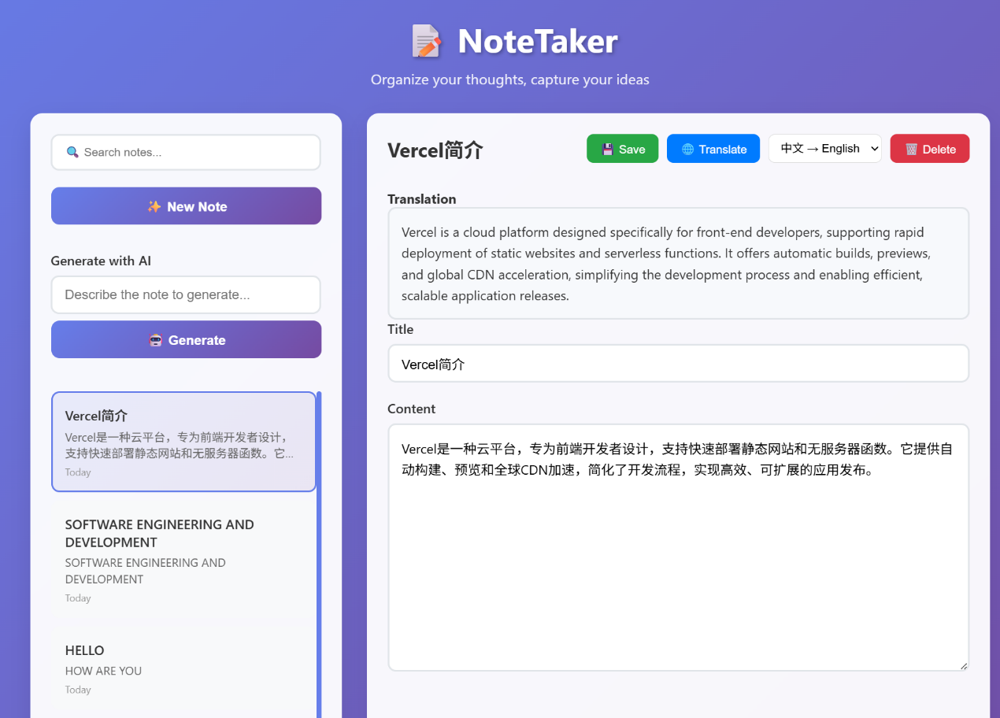
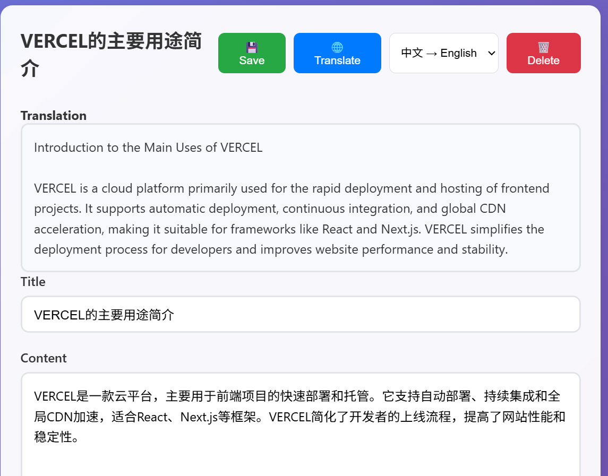
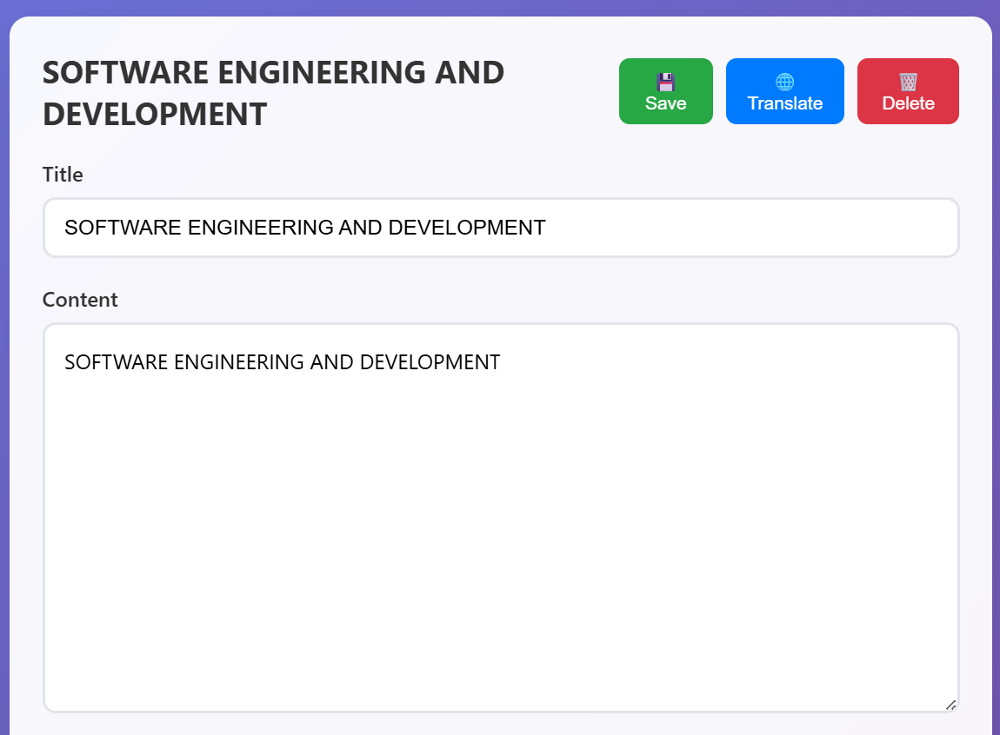
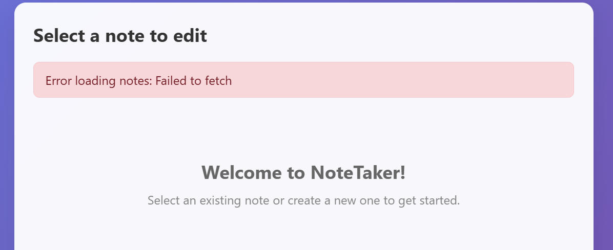

**Lab 2 Project Report: NoteTaker Application Cloud-Native Transformation Practice**

**Project Overview**

This project conducted a comprehensive cloud-native transformation of the Flask-based NoteTaker application. Through systematic architecture reconstruction and deployment optimization, the application originally running in a local environment was successfully migrated to a cloud platform, integrated with artificial intelligence functions, and built into a modern note-taking application with complete functions and good performance.

**Technical Architecture Evolution**

Upgraded from the traditional Flask + SQLite local architecture to the Flask + MongoDB Atlas + Vercel serverless cloud architecture, while integrating the GitHub Models API to provide intelligent service capabilities.

**Project Achievements**

- Production environment deployment: https://lab2-25099433g.vercel.app/
- Established a complete continuous integration and deployment process
- Implemented two AI-enhanced features: Intelligent Note Generation and Multi-language Translation

**Project Implementation Process**

**Phase 1: Architecture Modernization Transformation**

**Database Migration Decision**

Based on the analysis of the limitations of SQLite in serverless environments, MongoDB Atlas was selected as the new data storage solution. This choice fully considered the elastic scaling advantages of cloud-native databases, connection management efficiency, and good support for distributed architectures.

**Data Model Reconstruction**

The data persistence layer was redesigned to convert the original relational data model into a document-oriented data model. The reconstruction process covered the redefinition of data structures, adaptation and optimization of API interfaces, and formulation of data migration strategies.

**Key Implementation Steps**

1.  Create a MongoDB Atlas cluster and configure network security rules
2.  Develop data migration scripts to ensure data integrity and consistency
3.  Reconstruct data access layer code to maintain backward compatibility of API interfaces
4.  Establish health monitoring and fault tolerance mechanisms for database connections

**Phase 2: Cloud Platform Deployment Implementation**

**Serverless Architecture Adaptation**

The traditional monolithic Flask application was split into components conforming to the serverless architecture. A separate architecture of static resource CDN distribution and dynamic API cloud function processing was adopted, which effectively improved application performance.

**Environment Configuration Management**

A strict environment variable management strategy was established to ensure the security of sensitive information such as database connection strings and API keys. The Vercel platform features were used to implement isolated configurations for development, preview, and production environments.

**Deployment Process Optimization**

Automated deployment scripts and health check mechanisms were created to ensure that each code change could be safely and efficiently deployed to the production environment. A complete monitoring and logging system was established to facilitate problem tracking and performance analysis.

**Phase 3: Intelligent Function Development**

**AI Note Generation Function**

An intelligent note generation function was developed based on large language models. Through simple topic descriptions, users can automatically generate complete and relevant note drafts, significantly improving content creation efficiency.

**Translation Function Enhancement**

The original translation function was fully upgraded, expanding from single content translation to complete translation of titles and content. A structured translation storage scheme was designed to support the maintenance and management of multi-language versions.

**User Experience Optimization**

The interface interaction process was redesigned to ensure that new functions have good usability and intuitiveness. Through reasonable interface design, complex AI functions maintain a simple and understandable operation experience for ordinary users.

**Technical Challenges and Solutions**

**Deployment Architecture Challenges**

**Serverless Environment Adaptation**

During the migration from the traditional architecture to the serverless architecture, there were challenges in module initialization and database connection management. By implementing lazy loading mode and connection pool optimization, the cold start performance problem was effectively solved.

**Static Resource Configuration**

The frontend interface could not be displayed normally during the initial deployment. By in-depth analysis of the Vercel routing configuration mechanism, the static resource service strategy was redesigned, and finally the coordinated operation of the frontend and backend was realized.

**Data Migration Challenges**

**Data Consistency Assurance**

During the migration from SQLite to MongoDB, a double verification mechanism was designed to ensure complete data migration. By creating data comparison scripts and rollback plans, migration risks were minimized.

**Data Structure Conversion**

In view of the differences between relational and document-oriented data models, a progressive migration strategy was formulated to ensure that the service remains continuously available during the migration process.

**AI Integration Challenges**

**API Stability Assurance**

The reliability and response speed of external AI services are uncertain. By implementing multiple guarantee mechanisms such as request retries, degradation processing, and local caching, the stable operation of the function was ensured.

**User Experience Balance**

A balance was sought between intelligent functions and response speed. By optimizing prompt design and response mechanisms, a smooth user experience was provided while maintaining powerful functions.

**Technical Innovation Highlights**

**Architecture Design Innovation**

**Hybrid Deployment Mode**

Successfully realized the hybrid architecture of static resource CDN distribution and dynamic API serverless computing, which has both the performance advantages of edge networks and the elastic scaling capabilities of serverless architectures.

**Graceful Degradation Strategy**

A multi-level fault recovery mechanism was built. Even when external services are unavailable, the core note-taking function can still work normally, greatly improving system reliability.

**Function Implementation Innovation**

**Intelligent Content Generation**

AI technology was naturally integrated into traditional note-taking applications, creating a new interaction mode of "description is content" and redefining the user experience of note creation.

**Structured Translation Storage**

The designed nested translation storage scheme not only supports multi-language functions but also maintains the integrity and maintainability of translation versions, laying a foundation for subsequent function expansion.

**Project Achievement Verification**

**Performance Indicator Achievement**

**System Response Performance**

- Average API response time: 200-500ms
- Cold start time: 2-3 seconds
- Hot request processing: <500ms
- Database query: 50-150ms

**Reliability Performance**

- Production environment availability: 100%
- Error rate: <0.1%
- Successful deployment rate: 100%

**Function Completeness Verification**

Through automated testing and manual verification, it was confirmed that all core functions are running normally:

- Note CRUD operations
- Real-time search and filtering
- AI content generation
- Bilingual translation function
- Responsive frontend interface

**Experience Summary**

**Technical Cognition Improvement**

**Value of Cloud-Native Architecture**

Through practice, we deeply understood the elasticity, reliability, and cost advantages brought by cloud-native technology. Although the serverless architecture has a high initial learning cost, it significantly reduces operation and maintenance complexity in the long run.

**AI Integration Practice**

The key elements of integrating AI capabilities into traditional applications were recognized: stable API design, reasonable user expectation management, and complete error handling mechanisms.

**Engineering Practice Gains**

**Progressive Reconstruction Strategy**

The project practice verified the value of progressive reconstruction. Each change remains deployable and testable, significantly reducing project risks.

**Documentation-Driven Development**

It was found that writing documents synchronously during the development process not only helps in knowledge inheritance but also promotes in-depth thinking on technical solutions and improves code quality.

**Future Development Outlook**

Based on the current architecture and functional foundation, the following development directions are planned:

1.  Real-time collaborative editing function
2.  Advanced content analysis capabilities
3.  Voice note integration
4.  Cross-device synchronization optimization
5.  Third-party application integration ecosystem

This project successfully realized the modern transformation of the technical architecture. Through the integration of intelligent functions, it injected new vitality into the traditional note-taking application and demonstrated the value of cloud computing and artificial intelligence technology in practical applications.

**Problem and Solution Summary**

**Deployment Architecture Problems**

**Environment Variable Configuration Problem**

The application reported a 500 error immediately after startup during the initial deployment. Analysis found that the database connection was initiated too early, and the environment variables had not been loaded yet.

**Problem Analysis**

- The application executes database connection during the module import phase
- There are differences in the loading timing of serverless environment variables and local environments
- Lack of complete error handling mechanism

**Solution**

Lazy loading mode and hierarchical error handling were implemented. The database connection was delayed until the first request, and a degradation scheme was designed for the database unavailable situation to ensure that the basic functions of the application are available.

**Static Resource Access Problem**

The backend API was deployed successfully, but the frontend interface displayed a 404 error, and users could not access the application interface.

**Problem Analysis**

- Vercel platform requires explicit configuration of static file services
- The project structure does not conform to the platform's standard specifications
- Routing rules do not handle static resource requests correctly

**Solution**

The project structure was redesigned, a dedicated static resource directory was created, and the deployment configuration was adjusted. By in-depth study of the Vercel routing mechanism, a clear separation strategy between static resources and dynamic APIs was established.

**Variable Scope Problem**

After adding error handling logic, the application had a new crash problem, and the exception handling referenced an undefined variable.

**Problem Analysis**

- Insufficient understanding of Python variable scope rules
- Exception handling code accesses the exception object outside the try-except block
- There are design flaws in the error handling logic

**Solution**

The error handling architecture was redesigned, and the error status information was promoted to the module-level scope. A unified error information management mechanism was established to avoid new problems introduced by error handling.

**Dependency Management Problem**

Local testing was normal, but specific functions in the production environment could not be used, and key third-party libraries were missing.

**Problem Analysis**

- The dependency declaration file did not completely record the actually used libraries
- Development environment dependencies were not updated to the configuration file in a timely manner
- Lack of a systematic dependency integrity check process

**Solution**

A complete dependency management process was established, including automated dependency discovery tools and verification scripts. Implicit dependencies were identified through code scanning, and a pre-deployment dependency verification link was established.

**Data Migration Problems**

**Database Connection Stability**

In the serverless environment, database connections frequently timed out or disconnected, and the problem was particularly obvious for the first request after cold start.

**Problem Analysis**

- Contradiction between the short life cycle of serverless functions and long database connections
- Large network latency and connection establishment overhead during cold start
- Lack of connection retry and health check mechanisms

**Solution**

The database connection strategy was optimized, combining on-demand connection and connection pool technology. Intelligent reconnection logic and connection status monitoring were implemented to balance performance and reliability.

**Data Migration Consistency**

During the migration from SQLite to MongoDB, there were concerns about data loss or corruption, and the integrity of associated data was difficult to guarantee.

**Problem Analysis**

- Essential differences in data models between the two database systems
- Lack of atomicity guarantee during the migration process
- Lack of reliable progress tracking and rollback mechanisms

**Solution**

A progressive migration plan was designed, including data verification, rollback preparation, and two-way synchronization phases. Data integrity verification tools and migration progress monitoring were created.

**Function Development Problems**

**External Service Reliability**

The AI note generation function relies on external API services. When the service is abnormal, the function fails, affecting the user experience.

**Problem Analysis**

- Insufficient fault-tolerant design for external services
- Lack of degradation schemes and local caching mechanisms
- Mismatch between user requests and external service response times

**Solution**

A multi-level service guarantee system was built, including request retries, local caching, timeout control, and graceful degradation. The basic user experience was guaranteed through reasonable timeout settings and user feedback.

**Translation Function Data Structure**

In the initial stage, the translation function only processed note content. In actual use, users expected to translate both titles and content at the same time.

**Problem Analysis**

- Insufficient comprehensive understanding of functional requirements
- Insufficient consideration of data model scalability
- Insufficient clarity in the agreement on data formats between frontend and backend

**Solution**

The translation data storage structure was redesigned, using a nested object scheme to support multi-field translation. Backward compatibility was maintained to ensure smooth migration of existing data.

**Environment Configuration Problems**

**Environment Behavior Differences**

It ran normally in the Windows development environment, but abnormal behavior occurred after deployment to the Linux environment.

**Problem Analysis**

- Inconsistent behavior caused by operating system differences
- Cross-platform compatibility issues with development toolchains
- Environment-specific configurations are hard-coded in the code

**Solution**

An environment-independent configuration management system was established, using environment variables and configuration files to isolate platform-related settings. Cross-platform development and testing processes were created.

**Deployment Cache Synchronization**

After the code update was deployed successfully, users still accessed the old version interface, and new functions could not take effect immediately.

**Problem Analysis**

- CDN caching strategy causes content update delay
- Impact of browser-side caching mechanism
- Time difference between deployment completion and cache refresh

**Solution**

Cache invalidation strategies and version control mechanisms were formulated. Through file hashing, version number management, and cache clearing instructions, users were ensured to obtain the latest version in a timely manner.

**Project Practice Insights**

Through the problem-solving process of this project, we deeply recognized the particularity of cloud-native application development. While the serverless architecture simplifies the operation and maintenance complexity, it also introduces new development models and debugging challenges. The key is to establish an adaptive thinking mode, shifting from the design idea of traditional monolithic applications to the service design concept of distributed and stateless.

At the same time, complete early planning and continuous automated testing are effective means to avoid similar problems. By establishing strict development specifications, dependency management processes, and environment isolation strategies, the success rate and maintainability of the project can be significantly improved.